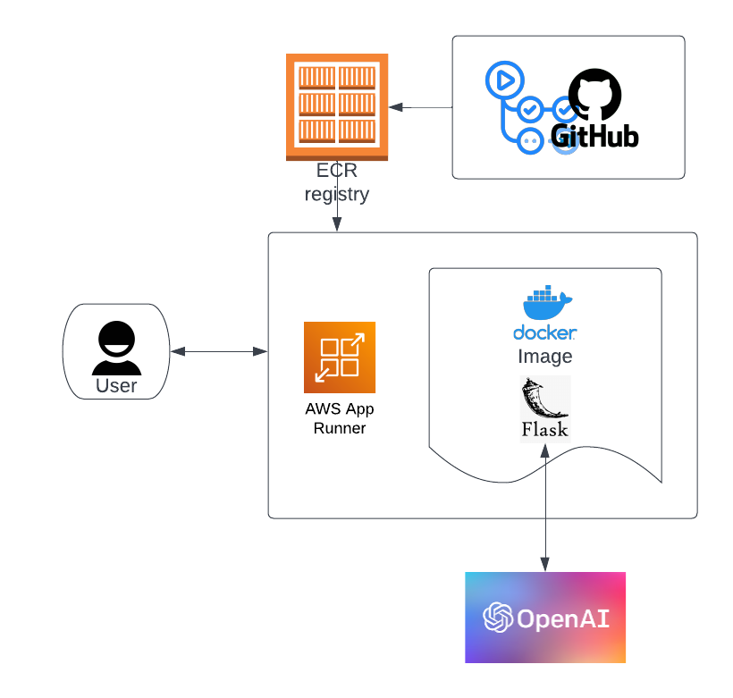
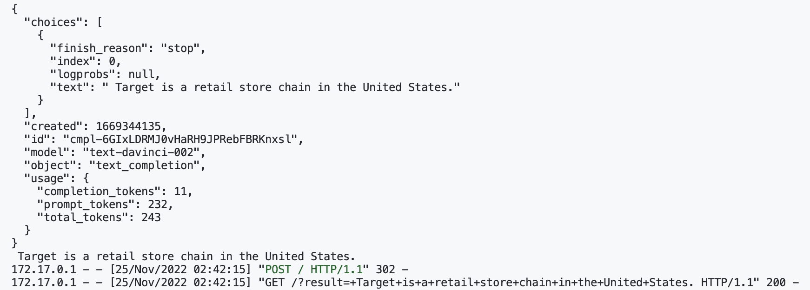
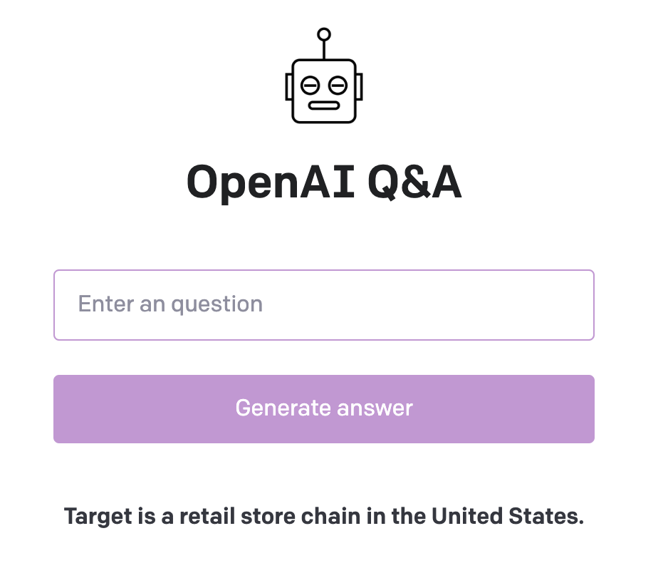
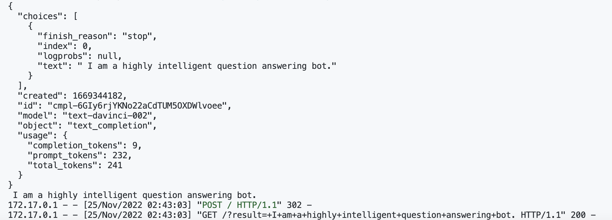
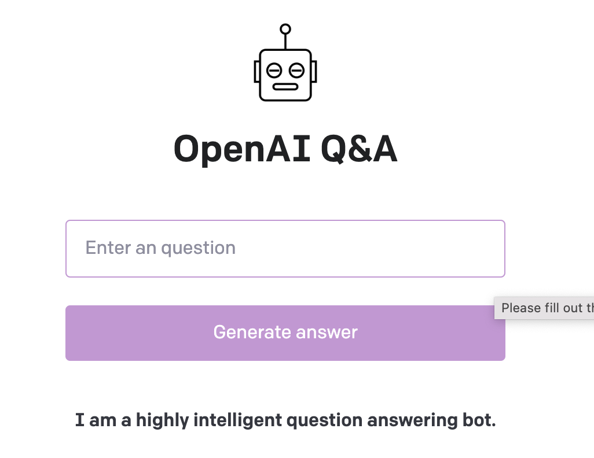

# IDS706-Project4-Yutong
This is the repo for IDS706 course project 4.

## Project description

- [*Microservice*](https://github.com/nogibjj/IDS706-Project4-Yutong/blob/main/openai-app/README.md): Highly intelligent question answering bot web app. The app is driven by Flask and OpenAI API. User can interactively input question, and a the answer will be displayed by Flask to user.
- *JSON payload*: The python program will send request to OpenAI. Then, a JSON paylaod will be responsed from OpenAI, where the answer could be get by parsing the JSON response.
- *CI/CD*: Driven by GitHub Actions, with delivery and delopy to AWS ECR. 

## Flow diagram

## Example
*Enter "What is target?" in web app*

JSON payload shows below:

Web app would show:

*Enter "Who are you?" in web app*

JSON payload shows below:

Web app would show:

## Usage

#### Access the web app with AWS App Runner
[Click here](https://54xqvaz2mq.us-east-1.awsapprunner.com)

#### Run on docker
Build docker image `docker build -t ids706-proj4 .`

Run in docker locally `docker run -p 5000:5000 -t -i ids706-proj4`

